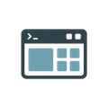

# termui
 

The `termui` package is designed to simplify output to a terminal window by allowing the specification of panes with static or dynamic content. These panes, defined by either vertical or horizontal splits, structure the terminal window. The main pane, which represents the entire terminal window, can be split into additional panes, which in turn can be further subdivided, much like the functionality found in the popular tool, tmux.

Pane sizes can be specified either as a percentage or by a fixed number of characters. The content within a pane can be dynamic, sourced from an attached function (referred to as a Widget in the example code below).

Panes can also feature borders, which are customisable by defining the characters to be used for each side (e.g., left edge, top-left corner, top bar, etc.).

The package utilises ANSI escape codes and has been tested on macOS and Linux.

This library is a refactored version of my older library called `terminal-ui` which
will be deprecated soon.

### Example

Please navigate to `cmd` directory to check example applications.
